# Instruction processing

The validator node handles instructions for multiple committees in tandem. Each asset managed by the node has its own committee which takes part in a consensus process to agree on the state of the asset and its tokens. This consensus process is continued until the asset is either retired or the nodes have all left the committee.

Most instructions are processed by the instruction thread workers which grab an asset's instructions from the queue to process them. In the case of the `create_asset` instruction this process is slightly different due to the need for the instruction to first gather a committee and confirm the payment fee transaction has processed.

## Participants

- Initiating validation node - node contacted by the end user to perform an instruction
- Asset committee validation nodes - nodes that work with the initiating validation node to validate and run instructions as a committee
- User - end user triggering instruction

## Create asset instruction

In order to create assets a committee must be formed prior to the asset creation.

There are two committee modes available:
- Creator
- Public

### Creator committee mode

The create asset instruction includes the trusted node set in the case of a creator committee.

- Initiating validation node receives instruction from the end user
- Initiating validation node parses the user's token and validates to confirm they have been granted access via their pubkey
- Initiating validation node performs [signature validation](https://rfc.tari.com/RFC-0311_AssetTemplates.html#signature-validation) on the create asset instruction
- Initiating validation node contacts trusted node set via Tari comms layer confirming they intend to process this asset
  - Failure may be caused by nodes not having granted access to the pubkey of the initiating user
  - Any failures lead to short circuiting of the create asset instruction by the initiating node
- All nodes put up [AssetCollateral](https://rfc.tari.com/Glossary.html#assetcollateral) on the base layer to join committee
- Initiating validation node handles payment fee processing
- Initiating validation node waits for confirmation on payment processing fee transaction
- Initiating validation node sends [create_asset](https://rfc.tari.com/RFC-0311_AssetTemplates.html#implementation) instruction
- Committee begins [consensus process](https://rfc.tari.com/RFC-0340_VNConsensusOverview.html#overview) processing pending instruction queue
- After consensus create data is now stored and committee is ready for processing instructions

### Public

Public committees are identical to creator committees aside from the process to select the initial validating nodes. In the create case (as mentioned above) the nodes are selected prior to the `create_asset` instruction. In the case of the public committee the nodes does not know which nodes it will be working with so it needs to first reach out to the network and select some.

- Initiating validation node receives instruction from the end user
- Initiating validation node parses the user's token and validates to confirm they have been granted access via their pubkey
- Initiating validation node performs [signature validation](https://rfc.tari.com/RFC-0311_AssetTemplates.html#signature-validation) on the create asset instruction
- Initiating validation node broadcasts to the network describing the asset to be created and listens for nodes accepting the broadcast
- Validation nodes desiring the asset broadcast their intention to join the committee to the initiator node
- Initiating validation node decides on whether to include validation nodes contacting it via the assets NodeSelectionStrategy
- All accepted nodes put up [AssetCollateral](https://rfc.tari.com/Glossary.html#assetcollateral) on the base layer to join committee
- Initiating validation node handles payment fee processing
- Initiating validation node waits for confirmation on payment processing fee transaction
- Initiating validation node sends [create_asset](https://rfc.tari.com/RFC-0311_AssetTemplates.html#implementation) instruction
- Committee begins [consensus process](https://rfc.tari.com/RFC-0340_VNConsensusOverview.html#overview) processing pending instruction queue
- After consensus create data is now stored and committee is ready for processing instructions

## Committee Consensus

- Members validate the instructions
  - Instructions that are invalid are marked as such (so the end user can see the state of their instruction) and not included in the NewView
- Members send NewView to the leader with their vision of the next state
- Leader expects NewView requests from other members
  - NewView includes a list of instructions included in the view
- Leader decides on a winning NewView to use as the next state from the committee messages
- Leader broadcasts out to other nodes letting them know of the NewView
- Other nodes validate the NewView and confirm that if they run those same instructions they get the same state
- Other nodes sign the NewView provided by the leader and send it back if they agree
- On supermajority the leader sends message back with the aggregated signatures
- Nodes validate the signatures and update their current state to the new state if good

## General instruction processing

The `create_asset` instruction is very different than general instructions run for the assets and their tokens. The instruction does include some additional validation work such as confirming the RAID ID but the major difference is the need to handle a payment and confirm the committee is capable of handling those instructions prior to broadcasting the instruction out.

### Given the following

- Each asset has its own committee
- Each committee runs through a set of instructions at a time
- Asset committee validation nodes can handle instructions as soon as they have the latest state and initial state
- State information can be pulled from peers

### On node start

- Instruction comes in from the network via the comms layer
- Stored in the db to be processed
- Node has a configurable number of instruction processors
- Instruction processors pool the database for any pending instructions
- Nodes finding a pending instruction
  - Instruction processor loads Committee state from the database
  - Node finds new leader
    - Leader: process instructions and stores proposal
    - Member: send NewView message to leader letting the leader know they are in charge of this round
  - Committee state is updated to indicate leader selection process is occurring
  - After some period if the leader selection fails (the node does not have a supermajority of NewView messages agreeing it is the leader) the nodes begin this process anew
- Leader receives NewView messages
  - Messages are processed and counted
  - Once supermajority of nodes agree this node is the leader
  - Leader sends its proposal to the other nodes
- Nodes see leader's proposal message
  - Nodes confirm proposal came from leader
  - Nodes fetch instruction list from the proposal and process the queue
  - Confirm the result
  - Sign the message and send it back to the leader
- Leader receives signed proposal messages
  - Messages are processed and counted
  - Once supermajority of nodes agree node sends back Quorum Certificate with aggregate signatures
- Nodes see [Quorum Certificate](https://rfc.tari.com/RFC-0340_VNConsensusOverview.html#quorum-certificate) signed with a supermajority of signatures
  - Nodes validate signatures
  - Nodes apply the proposal to their database

### Instruction states

### Pipeline

### Concerns

  - At what point is a new leader selected if the old does not handle these messages promptly? Could we end up in a state where there are never enough nodes in agreement about who the leader is to process instructions?
