# Single use tokens

Template ID | 1

## States

Single use tokens are analogue of tickets, which can be issued, sold, transferred and used. Each token state is token programmable state coupled with possible transaction-lock.

- Programmable states for Single Use Tokens:

## Operations

### Issue tokens

1. Asset issuer or authorized signers (later `issuer`) calling `issue_tokens`
2. VN ensures signatures, data integrity and other criteria (TBD) are valid
3. Creates Instruction `issue_tokens`
4. Tokens created in `Active` token state

### Sell token

Is a multi-stage transaction involding locking token record until given conditions met.

1. Issuer is calling `sell_token`(`TokenID`, `price`, `new owner`)
2. Initiating VN validates token data integrity and creates `Instruction` in `Processing` state `sell-token`
3. Initiating VN validates creates sub-`Instruction` `sell-token-lock`
  1. Creates temporary wallet (`tempWallet`) to accept payment
  2. Upon receipt of consensus from committee `tempWallet` is available to client in `sell-token` `Instruction` result
  3. Initiating VN keeps monitoring `tempWallet`, and once `price` amount appears:
  4. Initiating VN will create BL transactions to distribute tari's according to Asset settings
  5. Initiating VN will submit `sell-token` to `Commit` state, moving token to `Active` state with `new owner`
4. VN committee will validate all conditions met and provide consensus resolution `contract-transaction` as `Commit`
5. If any of above stages fail all the tari transfers should be cancelled or reverted

#### Sell token sequence diagram:

### Transfer token

The flow is similar to [Selling tokens] except that it might be triggered by token owner:

1. Owner is calling `transfer_token`(`TokenID`, `price`, `new owner`)
2. Leader VN validates token data integrity and ownership and starts new `Instruction`:
... other steps same as [Sell token](Sell token)

### Redeem token and Unredeem token

Both are single-step transactions.

1. Issuer is calling `redeem_token`(`TokenID`)
2. VN will ensure token integrity and that one other open transactions involiving token [^1]
  1. Leader VN will transition [^1] token to `Active`(`Used`) state changing owner back to asset `issuer`
  2. Leader VN will move `contract-transaction` to `PreCommit` state and publish transaction to committee
3. VN committee validate all conditions and mark `contract-transaction` as `Commit`
