## Pipeline

Template engine is responsible for reactive processing of instructions inline with pipeline:

## Objects

- Template - Tari uses templates to define the behaviour for its smart contracts. Template is a super trait, which represents set of traits defining smart contracts as well as hashable identifier, so that it can be located.
- TemplateRunner - executor of template instructions, it crawls through queue of incoming instructions for templates
- TemplateContext - is execution context for the template
- AssetTemplateContext is execution context for asset, able to execute instruction on asset
- TokenTemplateContext is execution context for token, able to execute instruction on token

### Implementation:

1. Middleware - actix middleware - generic HTTP handler, will extract pubkey (from auth token?), validate that token is signed with pubkey and add pubkey to Context
2. Endpoint Handler - actix handler on routes `/asset_call/:id` and `/token_call/:id` - find matching templateID, decode RPC method signature and params, call handler matching trait implementation parmeters `asset_call(..)` or `token_call(..)`. handler will create Instruction in `Scheduled` state and send message to `TemplateRunner` actor
3. Template Runner - accepting message with typed parameters will move Instruction to `Processing` state, call relevant template trait method, on success will transition Instruction as `Pending` with Value result, on failure transitions to `Invalid` with `{"error":message}` as result.
4. Smart Contract method would have access to token, asset details and operations via `AssetTemplateContext` or `TokenTemplateContext` depending on contract type
5. Consensus logic described in [instruction processing](../INSTRUCTION_PROCESSING.md)